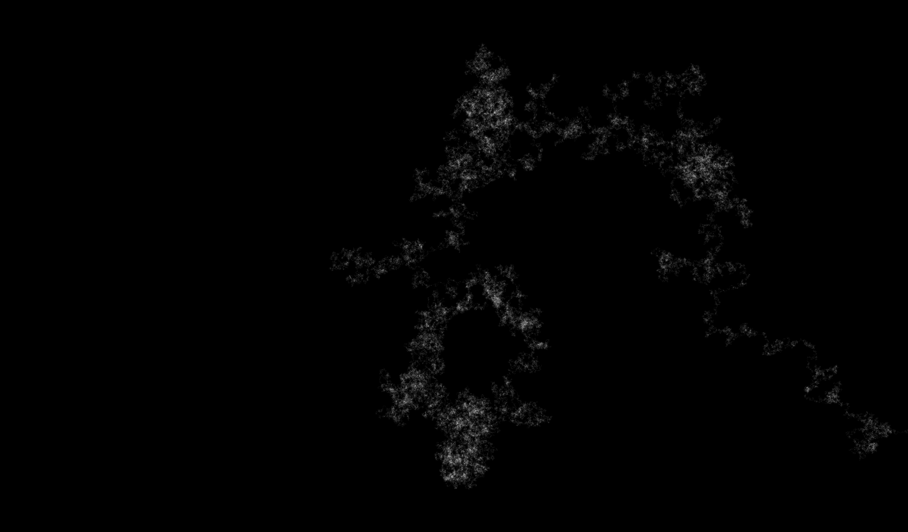

# Random Walk Simulator

Script that simulates a random walk given a specif grid size.  
The 'walk' stops when it reaches the border.

Functions were compiled with numba to enhance computation time.
https://numba.pydata.org/

Output gifs from a 20 x 20 and 50 x 50 pixels grid:

20 x 20             |  50 x 50
:-------------------------:|:-------------------------:
  |  

Output image of a 3001 x 3001 pixels grid:

